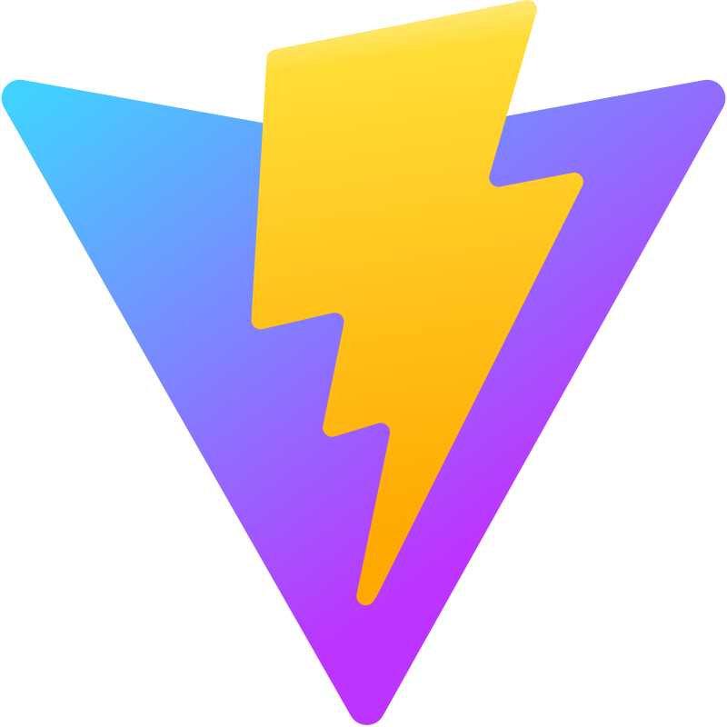

<h1 align="center">Hi 👋, I'm Derrick Lee</h1>
<h3 align="center">Solana Blockchain | Web3 | Trading Bot Developer.</h3>

 

- <h3>🌱 Passionate about Solana Blockchain</h3>

- <h3>📚 Love sharing knowledge</h3>

- <h3>🧩 Enthusiastic **Problem Solver** </h3>

- <h3>🌐 Future Open-Source **Contributor** </h3>

- <h3>❤️ Coding is my **Passion** </h3>

- <h3>⚡ Always **Curious** and **Creative**</h3>

 

<h3 align="left">Connect with me:</h3>

    
    
    
    
    
    

 

<h3 align="left">Languages and Tools:</h3>

    
    
    
    
    
    
    
    
    
    
    
    
    
    
    

 
